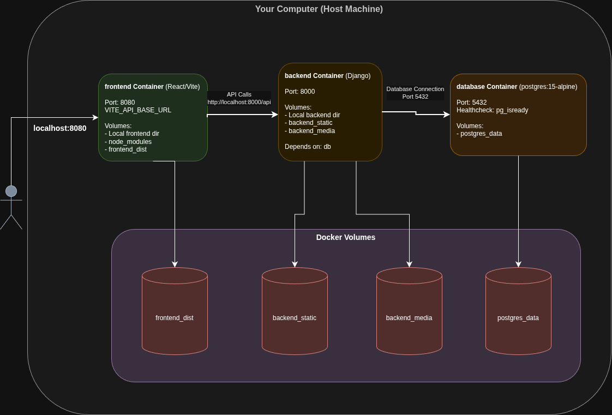
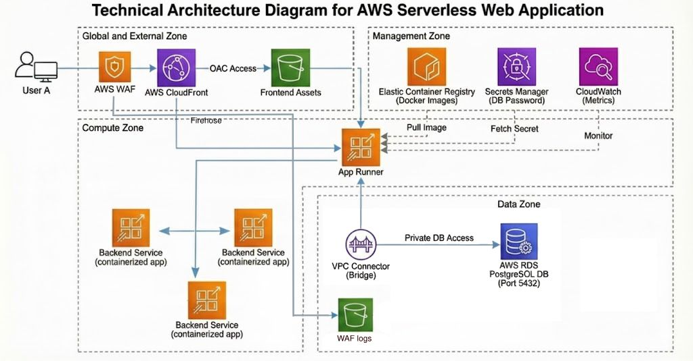

# Security-Of-Servers-And-Web-Applications

This repository showcases the final project for the university course **'Security of Servers and Web Applications'** at the **Wrocław University of Science and Technology**. We are students specializing in **Cybersecurity**.

Our primary goal was to not only develop a functional web application but, critically, to concentrate on **securing the Software Development Life Cycle (SDLC)**, **hardening the infrastructure**, and implementing **Infrastructure as Code (IaC)** principles. This ensures the entire stack is **flexible, resilient,** and **production-ready**.

The remainder of this document serves as a comprehensive **technical guide** to the technologies, security concepts, and architecture implemented throughout this project.
## Project Structure

```
Security-Of-Servers-And-Web-Applications/
├── .github/           # Files with GitHub Actions
|                       (CI/CD workflows and automated security checks)
├── backend/           # Django REST Framework backend
├── frontend/          # React + Vite + TypeScript frontend
├── terraform          # Terraform files for IaaC (Infrastructure as Code)
├── docker-compose.yml # Docker compose for all services
└── README.md          # This file
```

## Technologies

<div align="center">
   
   
   
   
   
   
   
	
	
	
	
</div>

## Table of Contents

1.  [Quick Start: Local Development](#1-quick-start-local-development)
2.  [Technologies & Application Implementation (L1/L2)](#2-technologies--application-implementation-l1l2)
    * [2.1 Application Features (L1)](#21-application-features-l1)
    * [2.2 Implementation Details (L2)](#22-implementation-details-l2)
3.  [Infrastructure Architecture Design & Implementation (L3/L4)](#3-infrastructure-architecture-design--implementation-l3l4)
    * [3.1 Quick Start: Deploying with Terraform](#31-quick-start-deploying-with-terraform)
    * [3.2 Architecture Design (L3)](#32-architecture-design-l3)
    * [3.3 Architecture Implementation (L4)](#33-architecture-implementation-l4)
4.  [CI/CD Process and Security Integration (L5/L6)](#4-cicd-process-and-security-integration-l5l6)
    * [4.1 CI/CD Process Design (L5)](#41-cicd-process-design-l5)
    * [4.2 Quick Start: Integrating GitHub Actions](#42-quick-start-integrating-github-actions)
    * [4.3 CI/CD Security Elements (L6)](#43-cicd-security-elements-l6)
5.  [Security Deep Dive: Code, Configuration, and Hardening (L7/L8)](#5-security-deep-dive-code-configuration-and-hardening-l7l8)
    * [5.1 Application and Environment Security Configuration (L7)](#51-application-and-environment-security-configuration-l7)
    * [5.2 Infrastructure Security and Hardening (L8)](#52-infrastructure-security-and-hardening-l8)
6.  [Solution Testing and Validation (L9)](#6-solution-testing-and-validation-l9)


## 1. Quick Start: Local Development

*After clonning this repository start the terminal in the clonned folder*

```bash
cp backend/env.example backend/.env
# Edit backend/.env with your settings
docker-compose up
docker-compose exec backend python manage.py create_sample_data
# Edit backend/sounds/management/commands/create_sample_data.py to change seed data
```

## 2. Technologies & Application Implementation (L1/L2)



### 2.1 Application Features (L1)

The application acts as a soundboard and community platform, allowing users to discover, play, and discuss various sound clips. The features are divided by user roles:

**General Users (Guests & Registered):**
* **Dashboard:** Browse and play sounds added to the system.
* **Filtering:** Filter sounds by specific Tags or "Favorites" lists.
* **Authentication:** Register a new account and Log in to the system.

**Authenticated Users:**
* **Favorites:** Add or remove sounds from a personal "Favorites" list.
* **Interaction:** Post comments on specific sounds.
* **Profile:** View logged-in user details.

**Administrators:**
* **Content Management:** Add, update, and remove Sounds and Tags in the system.
* **Tagging:** Assign multiple tags to sounds for better categorization.


### 2.2 Implementation Details (L2)

The application is built using a decoupled architecture, separating the frontend client from the backend API.


#### **Frontend Architecture**
The client-side is a Single Page Application (SPA) built to be fast and type-safe.
* **Framework:** **React** initialized with **Vite** for rapid development.
* **Language:** **TypeScript** for code reliability and static typing.
* **Styling:** **Tailwind CSS** combined with **Shadcn UI** components for a modern, accessible, and responsive design.
* **State Management:** React Context API (e.g., `AuthContext`) manages user sessions and global state.

#### **Backend API Architecture**
The server-side is built with **Django REST Framework (DRF)**. It exposes a standard RESTful API used by the frontend and includes JWT-based authentication.

**Key Endpoints:**

| Resource | Method | Endpoint | Description |
| :--- | :--- | :--- | :--- |
| **Authentication** | `POST` | `/api/auth/register/` | Register a new user |
| | `POST` | `/api/auth/login/` | Login (Returns Access/Refresh tokens) |
| | `POST` | `/api/auth/token/refresh/` | Refresh an expired access token |
| | `GET` | `/api/auth/me/` | Get current user details |
| **Sounds** | `GET` | `/api/sounds/` | List all sounds (Filterable) |
| | `POST` | `/api/sounds/` | Upload a new sound (**Admin only**) |
| | `PUT/DEL`| `/api/sounds/<id>/` | Update or Delete a sound (**Admin only**) |
| **Interaction** | `GET/POST`| `/api/comments/` | List or create comments |
| | `GET/POST`| `/api/favorites/` | List or add favorites |
| **System** | `GET` | `/api/tags/` | List available tags |
| | `GET` | `/admin/` | Standard Django Admin Dashboard |

> **Note:** Static and Media files (uploaded sounds) are served directly by Django during development (`settings.DEBUG = True`), but are offloaded to cloud storage in the production environment.

## 3. Infrastructure Architecture Design & Implementation (L3/L4)


This project utilizes Terraform to provision a fully serverless, secure, and scalable infrastructure on AWS. The architecture follows modern best practices, separating concerns between networking, compute, storage, and security.

### 3.1 Quick Start: Deploying with Terraform

> **Prerequisites**:
> - Ensure you have Terraform (>= 1.2.0) and the AWS CLI installed.
> - Ensure you have an active AWS account. Note: AWS App Runner is not part of the AWS Free Tier; using this infrastructure will incur costs. * Region: Verify that your target region supports AWS App Runner (the default in this configuration is eu-central-1)

#### Navigate to the terraform directory and initialize the project:
```bash
terraform init
```

Run the initial apply. Note: This first run is expected to error or time out on the aws_apprunner_service resource because the ECR repository is created empty, and App Runner cannot find an image to pull.

```bash
terraform apply
```

#### Configure AWS CLI

```bash
aws configure
aws configure list
#To check the setup
```

#### Build and Push Backend (Docker)
Once the ECR repository is created, you must push the Docker image so App Runner can start.

Retrieve the ECR URL and authenticate:
```bash
#Get the ECR URL from Terraform outputs
REPO_URL=$(terraform output -raw ecr_repo_url)
REGION=$(terraform output -raw aws_region) # Or your specific region

# Authenticate Docker to ECR
aws ecr get-login-password --region $REGION | docker login --username AWS --password-stdin $REPO_URL
```

Build and push the image:
```bash
# Build the image (adjust path to your backend folder)
docker build -t soundvault-backend ./backend

# Tag and Push
docker tag soundvault-backend:latest $REPO_URL:latest
docker push $REPO_URL:latest
```

#### Deploy Frontend (S3)
```bash
# Get the bucket name from Terraform outputs
BUCKET_NAME=$(terraform output -raw frontend_bucket_name)

# Build and Sync (adjust path to your frontend folder)
cd ../frontend
npm install && npm run build
aws s3 sync ./dist s3://$BUCKET_NAME --delete
```

#### Finalize Deployment

Now that the Docker image exists in ECR and the frontend assets are in S3, run Terraform again to finalize the App Runner service and complete the infrastructure setup.
```bash
terraform apply
```

### 3.2 Architecture Design (L3)
The architecture is designed for high availability, security, and low operational overhead. It employs a "Serverless-first" strategy for compute and a secure VPC architecture for data persistence.



- **Frontend** (Global Delivery): A Single Page Application (SPA) hosted on S3 and distributed globally via CloudFront. This ensures low latency and high transfer speeds for end-users, with strict access controls preventing direct S3 access.

- **Backend** (Containerized Compute): The API runs on AWS App Runner, a fully managed service that abstracts infrastructure management. It handles auto-scaling and load balancing automatically.

- **Database** (Isolated Persistence): Amazon RDS (PostgreSQL) is deployed in private subnets, ensuring it is not directly accessible from the public internet.

- **Networking & Security**: A custom VPC isolates the workload. Traffic between the App Runner service and the Database flows securely through a VPC Connector, never leaving the AWS private network. Secrets (like DB passwords) are managed by AWS Secrets Manager rather than hardcoded.

### 3.3 Architecture Implementation (L4)
The infrastructure implementation details are broken down by component:

1. Networking & Isolation


- VPC: A custom Virtual Private Cloud (10.0.0.0/16) is created with public and private subnets across 2 Availability Zones.


- NAT Gateway: A Single NAT Gateway is provisioned to allow resources in private subnets (like RDS) to access the internet for updates, while remaining unreachable from the outside.

2. Compute (AWS App Runner)

- Service: The backend runs as an aws_apprunner_service configured with 1 vCPU and 2GB memory.

- VPC Connectivity: An aws_apprunner_vpc_connector bridges the serverless App Runner environment with the private VPC subnets, allowing the application to connect to the RDS database.

- IAM Security: The instance role has a limited policy allowing it to pull images from ECR and retrieve specific secrets (DB password) from AWS Secrets Manager.

-  Configuration: Runtime variables are injected dynamically, including DB_HOST, DB_NAME, and CORS_ALLOWED_ORIGINS (linked to the CloudFront domain).

3. Content Delivery (S3 & CloudFront)

- Storage: The frontend assets are stored in a private S3 bucket with public access blocked.

- Origin Access Control (OAC): CloudFront accesses S3 via OAC (signing requests with SigV4), ensuring users can only view content through the CDN, not directly via S3.

- SPA Support: CloudFront is configured with custom error responses. It intercepts 403 and 404 errors and returns index.html (status 200) to support client-side routing.

- Caching: Uses the "Managed-CachingOptimized" policy to maximize performance.

4. Database (RDS PostgreSQL)

- Instance: A db.t3.micro PostgreSQL 15 instance is deployed.

- Security Groups: Ingress is strictly limited. The database only accepts traffic from the App Runner Security Group (application access) and a configurable Admin CIDR (maintenance access).

- Secrets Management: The database password is generated using a random_password resource and stored immediately in AWS Secrets Manager. The application retrieves this secret at runtime, ensuring the password is never exposed in plain text logs.

5. Monitoring

- CloudWatch Dashboard: A dashboard is automatically provisioned to visualize key metrics, including "App Runner Active Instances" and "App Runner Requests".